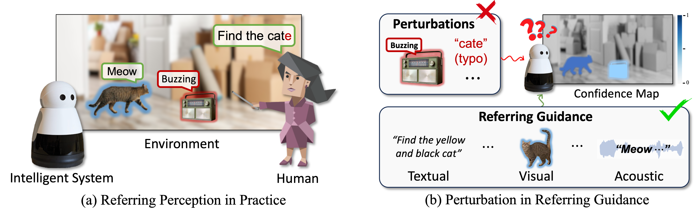

> [**R2-Bench: Benchmarking the Robustness of Referring Perception Models under Perturbations**](https://arxiv.org/abs/2403.04924)
>
> Xiang Li, Kai Qiu, Jinglu Wang, Xiaohao Xu, Rita Singh, Kashu Yamazaki, Hao Chen, Xiaonan Huang, Bhiksha Raj

<p align="center"></p>

# Updates
- **(2024-07-01)** R2-Bench got accepted to ECCV 2024! We are cleaning the remaining code and will release it by the end of July.
- **(2024-03-16)** We release the preview version of the noise synthesis toolbox!

# Instantiated Datasets
| Task | Original Dataset | Severity | Link |
|-----------------|-----------------|-----------------|-----------------|
| R-VOS | Youtube-Ref-VOS | 1 | [Link]() |
| R-VOS | Youtube-Ref-VOS | 3 | [Link]() |
| R-VOS | Youtube-Ref-VOS | 5 | [Link]() |
| R-VOS | Ref-DAVIS | 1 | [Link](https://drive.google.com/file/d/1JQrPHKr9zzP7W4V9sQgadVEjTSVWlJhS/view?usp=drive_link) |
| R-VOS | Ref-DAVIS | 3 | [Link](https://drive.google.com/file/d/1JQrPHKr9zzP7W4V9sQgadVEjTSVWlJhS/view?usp=drive_link) |
| R-VOS | Ref-DAVIS | 5 | [Link](https://drive.google.com/file/d/1JQrPHKr9zzP7W4V9sQgadVEjTSVWlJhS/view?usp=drive_link) |
| VOS | Youtube-VOS | 1 | Link |
| VOS | Youtube-VOS | 3 | Link |
| VOS | Youtube-VOS | 5 | Link |
| VOS | DAVIS | 1 | Link |
| VOS | DAVIS | 3 | Link |
| VOS | DAVIS | 5 | Link |
| RIS | Ref-COCO | 1 | Link |
| RIS | Ref-COCO | 3 | Link |
| RIS | Ref-COCO | 5 | Link |
| AVS | AVSBench-s3 | 1 | Link |
| AVS | AVSBench-s3 | 3 | Link |
| AVS | AVSBench-s3 | 5 | Link |
| AVS | AVSBench-ms4 | 1 | Link |
| AVS | AVSBench-ms4 | 3 | Link |
| AVS | AVSBench-ms4 | 5 | Link |

# Installation
```
conda create -n r2bench python=3.9
conda activate r2bench
pip install -r perturbation_toolbox/requirements.txt
```

# Example Usage
```
augmenter = ModalityAugmentation()
    # Example of using the class for audio
    samples, samplerate = sf.read('data/sample_0.wav')
    samples = samples.transpose()
    for noise_type in augmenter.audio_noise_functions.keys():
        if noise_type == "background_noise":
            samples = stereo_to_mono(samples)
            augmented_samples = augmenter.apply(samples, "audio", noise_type, severity=1, sample_rate=samplerate, background_path='data/sample_0.wav')
            augmented_samples = np.stack([augmented_samples, augmented_samples])
        else:
            augmented_samples = augmenter.apply(samples, "audio", noise_type, sample_rate=samplerate, severity=1)
        sf.write('augmented_samples.wav', augmented_samples.transpose(), samplerate)

    # Example of using the class for image
    image = Image.open('sample.png')
    if image.mode == 'RGBA':
        # Convert to RGB
        image = image.convert('RGB')

    for noise_type in augmenter.image_noise_functions.keys():
        augmented_image = augmenter.apply(image, "image", noise_type, severity=1)
        augmented_image_pil = Image.fromarray(np.uint8(augmented_image))
        augmented_image_pil.save('augmented_image.png')

    # Example of using the class for text
    for noise_type in augmenter.text_noise_functions.keys():
        print(noise_type, '################')
        answer = augmenter.apply("a dog that is running", "text", noise_type, severity=2)
        print(answer)
```

# Visualization
<p align="center"></p>

# Related works for robust referring perception:

> [Towards Robust Audiovisual Segmentation in Complex Environments with Quantization-based Semantic Decomposition](https://arxiv.org/abs/2310.00132), CVPR 2024

> [Robust Referring Video Object Segmentation with Cyclic Structural Consensus](https://arxiv.org/abs/2403.04924), ICCV 2023

## Citation
```
@article{li2024text,
  title={$$\backslash$text $\{$R$\}$\^{} 2$-Bench: Benchmarking the Robustness of Referring Perception Models under Perturbations},
  author={Li, Xiang and Qiu, Kai and Wang, Jinglu and Xu, Xiaohao and Singh, Rita and Yamazak, Kashu and Chen, Hao and Huang, Xiaonan and Raj, Bhiksha},
  journal={arXiv preprint arXiv:2403.04924},
  year={2024}
}
```
